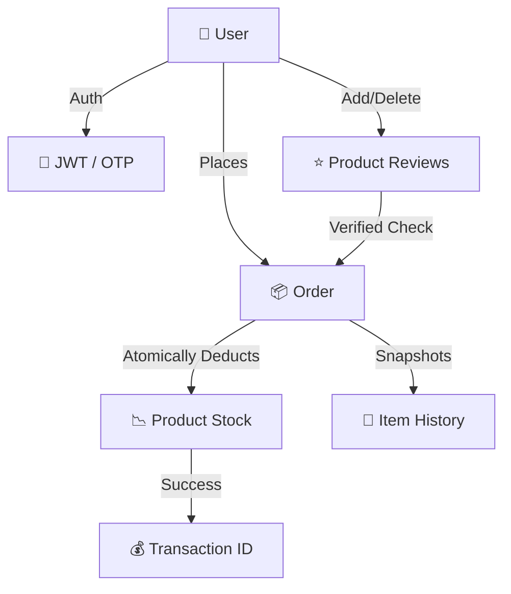

# KSR Aqua World | Professional Backend API ⚓

A high-performance, secure, and scalable E-commerce backend designed for professional fishing gear distribution. Built with **Django** and **Django REST Framework (DRF)**.

## 🏗️ Architecture & Logic Flow

The engine is built on a modular "Shop-Core" pattern, ensuring high data integrity even during peak traffic conditions.

### 🛡️ Security Implementation
*   **Atomic Stock Management**: Uses `select_for_update()` and `@transaction.atomic` to prevent race conditions. If two users buy the last item at the same time, the system locks the row to ensure zero overselling.
*   **API Throttling**: Implements `UserRateThrottle` and `AnonRateThrottle` to prevent brute-force attacks on OTP endpoints and protect against scraper bots.
*   **JWT Authentication**: Stateless authentication with 30-day sliding window access tokens for a seamless user experience.
*   **Production Hardening**: Integrated HSTS headers, SSL redirection, and secure proxy header recognition for PythonAnywhere deployment.

### 🔄 Dynamic Address System
The system features a multi-step "Saved Dock" (Saved Address) logic:
1.  **Map Integration**: Supports reverse geocoding coordinates into structured address objects.
2.  **Custom Labeling**: Allows users to categorize locations (Home, Office, Dock).
3.  **Order Persistence**: Automatically snapshots "Order Time" address details into the `OrderItem` model, ensuring history remains accurate even if the product price or description changes later.

## 📊 Data Logic Diagram

## 🛠️ Technical Stack
- **Framework**: Django 5.x + Django REST Framework
- **Auth**: SimpleJWT (JSON Web Tokens)
- **Email**: SMTP Integration for OTP verification
- **Database**: PostgreSQL (Production) / SQLite (Development)

## 🚀 Deployment Config
| Environment Variable | Description |
| :--- | :--- |
| `DEBUG` | Set to `False` for production security triggers |
| `ALLOWED_HOSTS` | Comma-separated domains for host filtering |
| `SECURE_SSL_REDIRECT` | Auto-forces HTTPS encryption |
| `THROTTLE_RATES` | Managed rate-limiting for API endpoints |

---
*Maintained for the KSR Aqua World Brand.*
